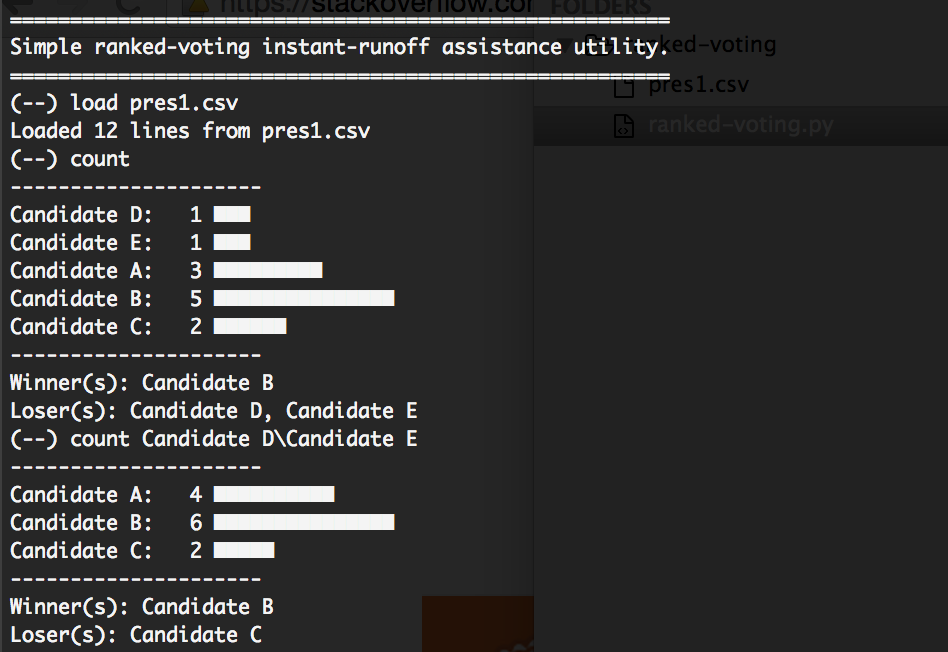

# Ranked Vote Elections

Interactive Shell for calculating the results of a Ranked-Vote Runoff Election.

**load [file]**: load a comma separated, newline broken file with the votes in the format
```
Timestamp,Your Name,First Choice,Second Choice,Third Choice
3/8/2015 13:52:41,Abbey Martin,Candidate B,Candidate C,Candidate E
3/8/2015 13:52:49,Ally Hadfield,Candidate C,Candidate A,Candidate B
3/8/2015 13:52:56,Alex Hachigian,Candidate A,Candidate B,Candidate D
```

**count**: distribute the votes, highest priority first. The above data would result in the following vote
```
Candidate B: 1
Candidate C: 1
Candidate A: 1
```

**count [ignore1\ignore2]**: distribute the votes, highest priority first _excluding_ the backslash separated _ignored_ candidates
```
count Candidate B
-----------------
Candidate C: 2
Candidate A: 1
```

## Example Output

Here is a screenshot of various commands being run against the provided sample file `pres1.csv`.

